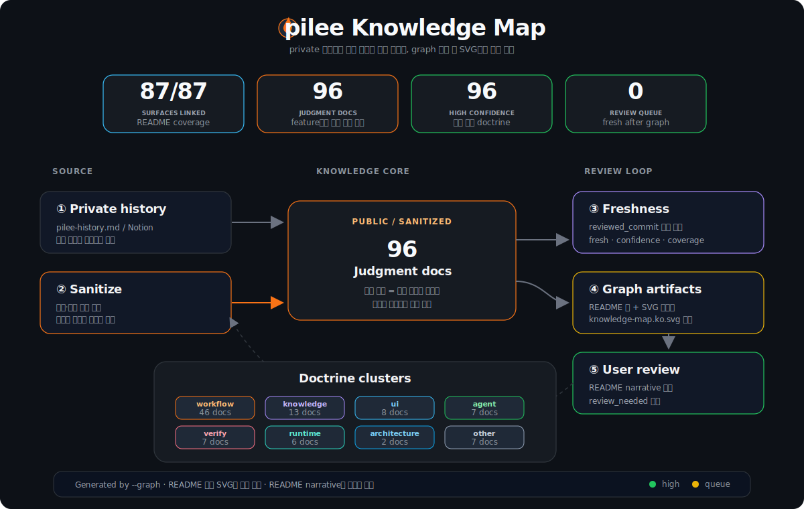

<p align="right">
  <strong>한글</strong> | <a href="./README.en.md">English</a>
</p>

# pilee 🔥

> 파이리(Charmander) + pi + Lee

[pi](https://github.com/badlogic/pi-mono) coding agent를 위한 개인 설정 패키지.
Conductor 1852세션에서 쌓은 경험을 기반으로, 포크나 래핑 없이 **처음부터 직접 구현**.

## Install

```bash
pi install https://github.com/heestolee/pilee
```

---

## 목차

- [설계 철학](#설계-철학)
- [핵심 워크플로](#핵심-워크플로)
- [Knowledge](#knowledge)
- [Extensions](#extensions)
- [Skills](#skills)
- [Agents](#agents)
- [Theme & Prompts](#theme--prompts)
- [토큰 최적화](#토큰-최적화)
- [단축키](#단축키)
- [구조](#구조)

---

## 설계 철학

### 왜 직접 만들었는가

[Conductor](https://www.conductor.build/)는 잘 만든 프로덕트였다. 워크트리 자동 관리, 다중 세션 병렬 실행, MCP 연결, 시스템 프롬프트 — 하나의 앱 안에서 다 해결해줬다.

하지만 1852세션, 185개 워크스페이스를 운용하면서 **제품의 구조적 한계**가 체감되기 시작했다.

### Conductor의 한계

**1. 커스텀하지 못한다 — 제품이 제공하는 기능만 사용 가능**

`repos` 테이블에 `custom_prompt_code_review` 등 커스텀 프롬프트 컬럼이 존재하지만, 이것이 전부다. 스킬 추가, 익스텐션 개발, 에이전트 정의, 도구 출력 렌더링 변경 — 제품이 허용하지 않은 동작은 확장할 수 없다. 개인적으로 ISP는 잘 준수되어 보이지만 OCP에서 탈락이라고 느꼈다.

**2. 워크트리를 늘릴수록 늘어나는 부하**

Git worktree 기반이지만, setup 시 node_modules를 심볼릭 링크가 아닌 물리 복사한다.

```
워크스페이스당 평균:  5.4GB (상위 10개 기준)
35개 워크스페이스 총: 123GB
conductor.db:       1.8GB (315K 메시지, 단일 SQLite)
```

워크스페이스를 스케일 아웃했더니 디스크가 스케일 업 됐다.

**3. 워크스페이스 복제 메커니즘의 불투명성과 메모리 과사용**

[공식 문서](https://www.conductor.build/docs/concepts/workspaces-and-branches)에는 워크스페이스의 **개념과 사용법**은 설명되어 있지만, 내부 복제 메커니즘(어떤 파일이 물리 복사되고 어떤 것이 링크되는지, `initialization_files_copied`나 `symlinks_pending_deletion`의 동작 방식)은 문서화되어 있지 않다. 복제 과정에서 MCP 설정(`.mcp.json`)이 누락되거나, 불필요한 파일이 생성되는 사례가 반복됐다.

앱 자체도 네이티브 바이너리(91MB) 상주에, 세션당 Claude Code 프로세스 ~220MB, 현재 24개 프로세스 합산 **1.6GB 메모리** 점유. 캡슐화가 잘 되어 있어서 문제가 생겨도 캡슐 안을 볼 수 없었다.

**4. 내부에서 제약을 걸어놓은 동작은 절대 실행하지 못함**

- 글로벌 MCP 설정이 외부 터미널에서는 동작하지만 Conductor 내부에서는 인식 안 됨
- 내장 터미널 한글 자모 분리 입력
- 외부에서 생성한 Git 브랜치에 워크스페이스 연결 불가

이런 제약이 의도된 것인지, 버그인지 판단할 수 없고 우회 방법도 없다. 방어적 프로그래밍이 사용자한테도 적용된 느낌이었다.

### pi가 커버하는 것

| Conductor 한계 | pi + pilee 대응 |
|---------------|----------------|
| 워크스페이스 복제 시 물리 파일 복사 → 디스크 선형 증가 | Git worktree만 생성, node_modules는 setup script에서 심볼릭 링크 또는 `npm install` 선택 가능. 워크스페이스 구조를 직접 제어 |
| 단일 SQLite 1.8GB 누적 | 세션별 개별 JSONL 파일 (`~/.pi/agent/sessions/`). 세션 간 I/O 간섭 없음, 필요 없는 세션은 삭제해도 다른 세션에 영향 없음 |
| 스킬/익스텐션 추가 불가 | 익스텐션 API (`registerCommand`, `registerTool`, `registerShortcut`, `ui.custom` TUI 등)로 자유롭게 확장 |
| 내부 제약 우회 불가 | 모든 동작이 TypeScript 코드로 열려 있음. 동작 변경이 필요하면 코드를 수정하고 `pi update` |
| 프롬프트 커스텀 컬럼 몇 개가 전부 | TFT 4 철칙, `(명백)` 패턴, frame→decide→verify 사이클, 14개 어색함 패턴 차단 등 워크플로 자체를 재설계 |
| 워크스페이스 복제 방식 불투명 | worktree 생성부터 대시보드 관리까지 전 과정이 `extensions/worktree/index.ts`에 명시적으로 정의 |
| 앱 91MB 상주 + 세션당 ~220MB | 터미널 프로세스만 존재 (세션당 ~60MB), OS 레벨 프로세스 격리 |

정리하면, Conductor는 **"잘 만든 기본값"** 이고, pilee는 **"내 워크플로에 맞춘 커스텀"** 이다. 1852세션의 경험이 있었기에 "뭐가 필요하고 뭐가 부족한지" 정확히 알고 만들 수 있었다.

---

## 핵심 워크플로

### frame → decide → verify 사이클

```
/frame    구조화된 계획 수립 (frame.json 생성)
  ↓         - success_criteria (행 단위 검증 가능)
  ↓         - verify_plan, risk_register, edge_case_seeds
/decide   frame에서 발생한 결정 사항 처리
  ↓         - TaskCreate(kind="frame.decision") 큐
  ↓
(구현)
  ↓
/verify   frame.json의 mechanical reader
            - success_criteria 행 단위 PASS/FAIL
            - 14개 어색함 패턴 차단 (의례적 질문, 범위 밖 가상 시나리오 등)
            - 미검증 항목 있으면 PR 진행 차단
```

### Atomic evidence workflow

pilee는 긴 context를 오래 들고 가는 것보다, 작업을 작은 claim/slice로 쪼개고 각 claim을 evidence로 닫는 것을 우선한다.

```
Frame        → claim/slice 합의
Worker       → 한 slice 최소 구현
Verify       → claim/evidence 판정
Final-check  → 완료 주장 재검증
```

도구 호출 성공은 사용자 성공이 아니다. UI/TUI/렌더링/리포트 claim은 실제 화면, artifact, 캡처로 닫아야 한다.

### subagent 위임 패턴

```
>> 커밋해줘              → worker가 백그라운드 자율 실행
>>/ 파일 찾아줘          → finder (read/grep/find only)
>>? 이 라이브러리 조사해  → searcher (웹 리서치)
>># 구현 계획 세워줘      → planner (opus + thinking:high)
>>! 이 계획 검증해줘      → challenger (반론/엣지케이스)
>>@ E2E 테스트 돌려줘     → browser (playwright)
>>> 히든 작업             → 결과가 LLM 컨텍스트에 안 들어감

/subagents              → 실행 중인 에이전트 목록
<>N                     → #N 에이전트 마지막 응답 미리보기
/sub:open N             → #N 세션 리플레이 오버레이
/sub:abort N            → #N 중단
```

`>>` 는 "보내고 결과만 받는" 단방향 위임. 실행 중 개입이 필요하면 fork-panel.

### worktree 대시보드

```
Ctrl+W                       → 전체 워크트리 오버레이
/wt new                      → 새 워크트리 (깨끗한 세션)
/wt new --carry-context      → 현재 세션 전체 transcript를 이어받아 새 워크트리 생성
/wt new --minimal-context    → source reference + 최근 prompt handoff만 첨부
/wt fork                     → 현재 세션 전체 transcript를 기본으로 이어받아 새 워크트리 생성
/wt fork --minimal-context   → lightweight handoff pack만 첨부
/wt resume <name>            → Conductor 워크스페이스 복원 + 전체 세션 hydrate
/wt bootstrap [status]       → profile 기반 readiness AI orchestrator + executor
/wt switch                   → 워크트리 선택 → 세션 선택 → cwd 전환
/wt sessions                 → 호환 alias: 현재/선택 워크트리의 /wt switch 세션 선택 흐름
```

`/wt new`와 `/wt fork`는 생성 후 현재 패널을 새 worktree 세션으로 즉시 전환한다. 에이전트 tool(`worktree_create`/`worktree_fork`/`worktree_switch`)도 같은 사용자 경험을 목표로 하되, command context의 `switchSession` 또는 tool context의 deferred `requestSessionSwitch`처럼 Pi 내부 session switch API가 있을 때만 진행한다. pilee worktree extension은 tool context에 `requestSessionSwitch`를 주입해 현재 agent turn이 idle이 된 뒤 `switchSession`을 요청한다. Ghostty에 `cd ... && pi --session ...`을 타이핑하는 keyboard/input-text relaunch fallback은 다른 패널 입력창 오염 위험 때문에 사용하지 않는다. 안전한 switch API가 없으면 worktree 생성 전 `BLOCKED`로 멈추며, 사용자에게 `/wt fork`/`/wt switch` 재입력을 요구하거나 절대경로 작업으로 우회하지 않는다.

생성 전 안전 게이트:
- 조사 단계(`확인해볼래?`)에서는 만들지 않는다.
- 조사/계획 맥락이 있으면 `worktree_create`가 아니라 `/wt fork` / `worktree_fork`로 현재 패널 대화를 source로 이어받는다. `/wt fork`의 기본은 전체 transcript 복사이며, 토큰/오염 위험 때문에 일부러 가볍게 넘길 때만 `--minimal-context`를 명시한다.
- 핫픽스/production 작업은 반드시 `--hotfix` / `hotfix: true`로 production 기반에서 만든다.
- fork child 패널(P1/P2)도 worktree를 만들 수 있다. 이때 source는 현재 패널 대화이며, 부모(P0) 대화를 기준으로 만들고 싶을 때만 부모 패널에서 명시적으로 실행한다.
- profile이 bootstrap 대상으로 지정한 worktree에서 구현이 시작되면 `/wt`가 AI subagent orchestrator를 띄워 deterministic executor를 실행·진단하게 한다. domain은 profile이 정의한 dependency/env 등 marker로 확장할 수 있고, 수동 실행은 `/wt bootstrap --<domain>`, `/wt bootstrap --domain <name>`, `/wt bootstrap --env`, `/wt bootstrap --all`을 지원한다. 상태 확인은 `/wt bootstrap status`, deterministic fallback은 `/wt bootstrap --executor`.

대시보드 상태: `backlog` / `active` / `done` / `archive`
- `Space`: backlog → active → done 순환
- `a`: 아카이브 ↔ 메인 양방향 이동
- `Tab`: 메인 탭 ↔ 아카이브 탭 전환
- `t`: 태그 편집, `/`: 필터

### stress-interview → self-healing

```
/stress-interview   3 병렬 에이전트가 코드 리뷰
                      - verifier: 구현 정확성
                      - reviewer: 코드 품질/패턴
                      - challenger: 반론/엣지 케이스
  ↓
/self-healing       stress-interview 결과 기반 자동 수정 (2사이클)
                      - fix_class 분류: AUTO_FIX / ASK / INFO
```

### TFT 4 철칙

모든 스킬과 에이전트가 따르는 행동 원칙:

| # | 철칙 | 핵심 |
|---|------|------|
| 1 | **분기점 질문 의무** | 결과가 달라지는 선택지에서는 반드시 묻는다. 확실한 건 `(명백: 근거)` 표기 후 진행 |
| 2 | **위험 결정 단독 금지** | 되돌리기 어려운 작업은 혼자 판단하지 않는다 |
| 3 | **근거 없는 완료 금지** | "다 됐다"는 증거 기반이어야 한다 |
| 4 | **결과 정해진 질문 금지** | "(처리됨)" 같은 선택지로 동의만 구하는 의례적 질문을 하지 않는다 |

**`(명백)` 패턴**: "묻기 vs 안 묻기" 이분법의 제3의 길.
가정을 본문에 `(명백: 저장소 컨벤션)` 형태로 명시하고 진행. 사용자 침묵 = 동의, 틀리면 교정.

---

## Knowledge

공개 가능한 최신 설계 지식은 [docs/knowledge/README.md](./docs/knowledge/README.md)에서 검색/그래프 형태로 확인합니다.

**불씨 / Ember**는 이 knowledge를 다루는 친근한 입구입니다. `/ember`로 세션에서 남은 깨달음을 후보로 모으고 add 여부를 선택합니다. `/ember add`는 명시적으로 바로 public knowledge 작성/갱신 플로우로 들어갑니다. `/ember check`는 freshness/confidence 상태를 살피고 필요 action을 제안하며, `/ember refresh`는 README table, docs/knowledge README, SVG map 같은 generated surface를 재생성·검증합니다. 저장소의 canonical 용어와 구조는 계속 `knowledge`입니다.

회사/개인/로컬 실행 맥락은 public pilee에 넣지 않고 private overlay package에 둡니다. 새 overlay를 만들 때는 fake ACME 예시만 담은 public-safe 템플릿 [pilee-private-overlay-template](https://github.com/heestolee/pilee-private-overlay-template)을 복사해 `pi/skills`, `pi/prompts`, `pi/profiles/*.json`을 자기 환경에 맞게 채우면 됩니다.

<p align="center">
  
</p>

<!-- PILEE_ROOT_KNOWLEDGE_LINKS_START -->
> Source docs drive this generated block; refresh with `node scripts/knowledge.mjs --graph` after changes.

| Type | Surface | Knowledge docs |
|---|---|---|
| extension | `extensions/archive-to-html` | [검토 산출물은 다시 열 수 있어야 한다](./docs/knowledge/artifact-archive-reopenability.md)<br>[Backlog는 원 세션 출처를 보존한다](./docs/knowledge/backlog-source-session-provenance.md)<br>[Clean handoff는 compact와 새 세션 사이의 전환 계약이다](./docs/knowledge/clean-handoff-session-continuation.md)<br>[Deterministic fallback은 workflow를 보존한다](./docs/knowledge/deterministic-fallbacks-preserve-workflow.md)<br>[Embedded WebView script는 escape 경계를 보존한다](./docs/knowledge/embedded-webview-script-escape-boundary.md)<br>[완료 선언은 증거 뒤에만 온다](./docs/knowledge/evidence-first-verification-gate.md)<br>[TFT Studio는 TFT 단계를 작업 단위 UI로 묶는다](./docs/knowledge/frame-studio-interactive-decision-ui.md)<br>[Live artifact는 local preview first다](./docs/knowledge/live-artifact-preview-pattern.md)<br>[Private overlay package는 회사·개인 실행 맥락을 담는다](./docs/knowledge/private-overlay-package-boundary.md)<br>[세션 분류는 원본 위의 sidecar다](./docs/knowledge/session-classification-sidecar.md)<br>[Session export는 원본을 보존하는 adapter를 거친다](./docs/knowledge/session-export-source-preservation.md)<br>[터미널 연동은 host adapter로 다룬다](./docs/knowledge/terminal-host-integration.md)<br>[Verify Report와 coverage-aware 증거 검증 흐름](./docs/knowledge/verify-report-workflow.md) |
| extension | `extensions/auto-commit` | [Auto-commit은 명시 계획만 실행한다](./docs/knowledge/auto-commit-explicit-plan-gate.md)<br>[Slice 완료는 commit 후보를 만든다](./docs/knowledge/slice-auto-commit-rhythm.md) |
| extension | `extensions/backlog` | [검토 산출물은 다시 열 수 있어야 한다](./docs/knowledge/artifact-archive-reopenability.md)<br>[Backlog는 원 세션 출처를 보존한다](./docs/knowledge/backlog-source-session-provenance.md)<br>[Session export는 원본을 보존하는 adapter를 거친다](./docs/knowledge/session-export-source-preservation.md)<br>[색상은 정보 위계다](./docs/knowledge/theme-information-hierarchy.md)<br>[TUI 렌더링 경계에서는 문자열을 신뢰하지 않는다](./docs/knowledge/tui-rendering-sanitization.md) |
| extension | `extensions/bash-tool-override` | [Bash tool override는 명령 의도와 출력 노이즈를 분리한다](./docs/knowledge/bash-tool-title-output-override.md) |
| extension | `extensions/cc-system-prompt` | [자동 로드 컨텍스트는 최소 surface만 가진다](./docs/knowledge/context-loading-minimal-surface.md) |
| extension | `extensions/claude-code-ui` | [도구 출력은 대화 흐름을 침범하지 않는다](./docs/knowledge/tool-output-noise-management.md)<br>[TUI 렌더링 경계에서는 문자열을 신뢰하지 않는다](./docs/knowledge/tui-rendering-sanitization.md) |
| extension | `extensions/claude-hooks-bridge` | [자동 로드 컨텍스트는 최소 surface만 가진다](./docs/knowledge/context-loading-minimal-surface.md) |
| extension | `extensions/codex-fast-mode` | [Codex fast mode는 출력 verbosity와 priority tier만 줄인다](./docs/knowledge/codex-fast-mode-runtime.md) |
| extension | `extensions/context-loader` | [자동 로드 컨텍스트는 최소 surface만 가진다](./docs/knowledge/context-loading-minimal-surface.md) |
| extension | `extensions/continue-clean` | [Clean handoff는 compact와 새 세션 사이의 전환 계약이다](./docs/knowledge/clean-handoff-session-continuation.md) |
| extension | `extensions/custom-style` | [Codex fast mode는 출력 verbosity와 priority tier만 줄인다](./docs/knowledge/codex-fast-mode-runtime.md)<br>[Editor affordance는 숨은 컨텍스트가 아니다](./docs/knowledge/editor-affordance-not-context.md)<br>[User-facing 출력은 한국어를 기본으로 한다](./docs/knowledge/korean-first-user-facing-output.md)<br>[터미널 연동은 host adapter로 다룬다](./docs/knowledge/terminal-host-integration.md)<br>[색상은 정보 위계다](./docs/knowledge/theme-information-hierarchy.md) |
| extension | `extensions/diff-overlay` | [Diff review draft는 PR 코멘트 전 단계다](./docs/knowledge/diff-review-draft-handoff.md)<br>[색상은 정보 위계다](./docs/knowledge/theme-information-hierarchy.md)<br>[TUI 렌더링 경계에서는 문자열을 신뢰하지 않는다](./docs/knowledge/tui-rendering-sanitization.md) |
| extension | `extensions/dynamic-agents-md` | [자동 로드 컨텍스트는 최소 surface만 가진다](./docs/knowledge/context-loading-minimal-surface.md)<br>[Skill은 재사용 가능한 절차다](./docs/knowledge/skills-as-portable-procedures.md) |
| extension | `extensions/edit-tool-override` | [Read/Edit tool override는 필요한 증거만 펼친다](./docs/knowledge/read-edit-tool-output-override.md) |
| extension | `extensions/ember` | [Ember는 knowledge의 친근한 입구다](./docs/knowledge/ember-friendly-knowledge-entrypoint.md)<br>[Ember Ship은 knowledge 정합성을 release train으로 닫는다](./docs/knowledge/ember-ship-release-train.md) |
| extension | `extensions/ember-ship` | [Ember는 knowledge의 친근한 입구다](./docs/knowledge/ember-friendly-knowledge-entrypoint.md)<br>[Ember Ship은 knowledge 정합성을 release train으로 닫는다](./docs/knowledge/ember-ship-release-train.md)<br>[Knowledge review queue는 PR body에 남긴다](./docs/knowledge/knowledge-review-queue-pr-body.md)<br>[Skill은 재사용 가능한 절차다](./docs/knowledge/skills-as-portable-procedures.md)<br>[Command shim은 reviewable workflow source of truth를 지킨다](./docs/knowledge/tft-command-shim-skill-routing.md) |
| extension | `extensions/footer` | [Editor affordance는 숨은 컨텍스트가 아니다](./docs/knowledge/editor-affordance-not-context.md) |
| extension | `extensions/fork-panel` | [Fork-panel handoff는 parent inbox로 들어간다](./docs/knowledge/fork-panel-parent-inbox.md)<br>[Fork-panel 위치는 작업 맥락의 일부다](./docs/knowledge/fork-panel-spatial-continuity.md)<br>[MCP stderr는 TUI 출력이 아니다](./docs/knowledge/mcp-stderr-isolation.md)<br>[종료된 포크는 transcript 주입보다 revive가 우선이다](./docs/knowledge/revive-over-transcript-recall.md)<br>[세션 식별자는 파일명이 아니라 사람이 본 이름이다](./docs/knowledge/session-identity-over-filenames.md)<br>[터미널 연동은 host adapter로 다룬다](./docs/knowledge/terminal-host-integration.md)<br>[터미널 workspace 복원은 snapshot과 host adapter를 분리한다](./docs/knowledge/terminal-workspace-restore.md)<br>[색상은 정보 위계다](./docs/knowledge/theme-information-hierarchy.md)<br>[TUI 렌더링 경계에서는 문자열을 신뢰하지 않는다](./docs/knowledge/tui-rendering-sanitization.md)<br>[Worktree 생성은 현재 패널 대화가 source다](./docs/knowledge/worktree-creation-parent-gate.md)<br>[Worktree 세션 연속성과 식별성 원칙](./docs/knowledge/worktree-session-continuity.md) |
| extension | `extensions/frame-studio` | [AskUserQuestion은 의사결정 게이트다](./docs/knowledge/ask-user-question-decision-gates.md)<br>[AskUserQuestion 옵션은 행동 분기를 표현한다](./docs/knowledge/ask-user-question-option-design.md)<br>[Decide는 선택을 한 번 공격한다](./docs/knowledge/decide-tradeoff-challenge.md)<br>[Embedded WebView script는 escape 경계를 보존한다](./docs/knowledge/embedded-webview-script-escape-boundary.md)<br>[Frame은 마지막에 Plan을 합성한다](./docs/knowledge/frame-plan-synthesis-continuity.md)<br>[TFT Studio는 TFT 단계를 작업 단위 UI로 묶는다](./docs/knowledge/frame-studio-interactive-decision-ui.md)<br>[Live artifact는 local preview first다](./docs/knowledge/live-artifact-preview-pattern.md)<br>[Queued command는 실행 보장이 아니다](./docs/knowledge/queued-command-prefill-boundary.md)<br>[정확한 기획 근거가 있으면 Frame은 추적 매트릭스를 만든다](./docs/knowledge/source-grounded-frame-planning.md)<br>[Task overlay는 작업 맵을 보존한다](./docs/knowledge/task-work-map-overlay.md)<br>[TFT visual은 구조 변화를 학습 가능한 그림으로 보여준다](./docs/knowledge/tft-visual-structure-renderer.md)<br>[Working Context Card는 큰 맥락을 현재 slice로 압축한다](./docs/knowledge/work-context-card-task-board.md)<br>[반복 워크플로 실패는 guard/flow로 고정한다](./docs/knowledge/workflow-guard-enforced-flow.md) |
| extension | `extensions/idle-screensaver` | [Idle UI는 장식이 아니라 ambient status다](./docs/knowledge/ambient-status-surfaces.md)<br>[색상은 정보 위계다](./docs/knowledge/theme-information-hierarchy.md) |
| extension | `extensions/interactive-shell` | [Interactive shell은 bash가 아닌 터미널 세션이다](./docs/knowledge/interactive-shell-overlay-tool.md) |
| extension | `extensions/mcp-bridge` | [검토 산출물은 다시 열 수 있어야 한다](./docs/knowledge/artifact-archive-reopenability.md)<br>[Deterministic fallback은 workflow를 보존한다](./docs/knowledge/deterministic-fallbacks-preserve-workflow.md)<br>[MCP 결과는 구조화 출력부터 digest-first로 다룬다](./docs/knowledge/mcp-digest-first-artifacts.md)<br>[MCP stderr는 TUI 출력이 아니다](./docs/knowledge/mcp-stderr-isolation.md)<br>[터미널 연동은 host adapter로 다룬다](./docs/knowledge/terminal-host-integration.md)<br>[도구 출력은 대화 흐름을 침범하지 않는다](./docs/knowledge/tool-output-noise-management.md) |
| extension | `extensions/memory-layer` | [자동 로드 컨텍스트는 최소 surface만 가진다](./docs/knowledge/context-loading-minimal-surface.md) |
| extension | `extensions/notify` | [터미널 연동은 host adapter로 다룬다](./docs/knowledge/terminal-host-integration.md) |
| extension | `extensions/pilee-update` | [pilee update는 현재 세션 reload까지 닫아야 한다](./docs/knowledge/pilee-update-current-session-reload.md) |
| extension | `extensions/pr-comments` | [Diff review draft는 PR 코멘트 전 단계다](./docs/knowledge/diff-review-draft-handoff.md)<br>[Ship과 PR-Ship은 서로 다른 통합 단계다](./docs/knowledge/ship-pr-ship-review-boundary.md) |
| extension | `extensions/pr-review-re-request` | [Ship과 PR-Ship은 서로 다른 통합 단계다](./docs/knowledge/ship-pr-ship-review-boundary.md) |
| extension | `extensions/preflight` | [Private overlay package는 회사·개인 실행 맥락을 담는다](./docs/knowledge/private-overlay-package-boundary.md)<br>[수정 전에 근본 원인을 좁힌다](./docs/knowledge/root-cause-before-fix.md)<br>[반복 검증 실패는 baseline cache로 분리한다](./docs/knowledge/validation-baseline-failure-cache.md)<br>[반복 워크플로 실패는 guard/flow로 고정한다](./docs/knowledge/workflow-guard-enforced-flow.md) |
| extension | `extensions/prompt-suggest-lite` | [Editor affordance는 숨은 컨텍스트가 아니다](./docs/knowledge/editor-affordance-not-context.md) |
| extension | `extensions/queued-messages` | [Queued command는 실행 보장이 아니다](./docs/knowledge/queued-command-prefill-boundary.md) |
| extension | `extensions/read-tool-override` | [Read/Edit tool override는 필요한 증거만 펼친다](./docs/knowledge/read-edit-tool-output-override.md) |
| extension | `extensions/retro` | [Retro는 private reflection이다](./docs/knowledge/retro-private-reflection-boundary.md) |
| extension | `extensions/session-title` | [Backlog는 원 세션 출처를 보존한다](./docs/knowledge/backlog-source-session-provenance.md)<br>[세션 식별자는 파일명이 아니라 사람이 본 이름이다](./docs/knowledge/session-identity-over-filenames.md) |
| extension | `extensions/ship-commands` | [CI-Ship은 PR 후 검증 실패 대응 단계다](./docs/knowledge/ci-ship-failure-response-boundary.md)<br>[Ship과 PR-Ship은 서로 다른 통합 단계다](./docs/knowledge/ship-pr-ship-review-boundary.md)<br>[Subagent는 slash command가 아니라 skill prompt를 위임받는다](./docs/knowledge/subagent-skill-delegation.md) |
| extension | `extensions/shortcut-atlas` | [Shortcut Atlas는 단축키 표면을 한 번에 검토한다](./docs/knowledge/shortcut-atlas-conflict-audit.md) |
| extension | `extensions/spinner` | [Idle UI는 장식이 아니라 ambient status다](./docs/knowledge/ambient-status-surfaces.md) |
| extension | `extensions/subagent` | [Worker는 readiness ownership을 가진다](./docs/knowledge/ai-worker-readiness-orchestrator.md)<br>[최종 검증은 메인 세션을 막지 않고 병렬화한다](./docs/knowledge/final-verification-parallelization.md)<br>[Queued command는 실행 보장이 아니다](./docs/knowledge/queued-command-prefill-boundary.md)<br>[Self-healing은 actionable item만 수정한다](./docs/knowledge/self-healing-actionable-loop.md)<br>[Stress Interview는 다축 검토다](./docs/knowledge/stress-interview-multi-axis-review.md)<br>[Hybrid subagent 모델 운용 정책](./docs/knowledge/subagent-model-policy.md)<br>[Subagent 위임은 구체 프롬프트를 요구한다](./docs/knowledge/subagent-prompt-specificity.md)<br>[Subagent는 slash command가 아니라 skill prompt를 위임받는다](./docs/knowledge/subagent-skill-delegation.md) |
| extension | `extensions/supervisor` | [Supervisor는 outcome guardrail이다](./docs/knowledge/supervisor-outcome-guardrail.md) |
| extension | `extensions/tasks` | [Idle UI는 장식이 아니라 ambient status다](./docs/knowledge/ambient-status-surfaces.md)<br>[Backlog는 원 세션 출처를 보존한다](./docs/knowledge/backlog-source-session-provenance.md)<br>[Queued command는 실행 보장이 아니다](./docs/knowledge/queued-command-prefill-boundary.md)<br>[정확한 기획 근거가 있으면 Frame은 추적 매트릭스를 만든다](./docs/knowledge/source-grounded-frame-planning.md)<br>[Task overlay는 작업 맵을 보존한다](./docs/knowledge/task-work-map-overlay.md)<br>[Working Context Card는 큰 맥락을 현재 slice로 압축한다](./docs/knowledge/work-context-card-task-board.md) |
| extension | `extensions/test-refine` | [테스트는 책임 경계에 맞춰 다듬는다](./docs/knowledge/test-boundary-refactor.md) |
| extension | `extensions/tft-commands` | [Frame identity는 cwd보다 작업 의도를 우선한다](./docs/knowledge/frame-planning-identity.md)<br>[TFT Studio는 TFT 단계를 작업 단위 UI로 묶는다](./docs/knowledge/frame-studio-interactive-decision-ui.md)<br>[Queued command는 실행 보장이 아니다](./docs/knowledge/queued-command-prefill-boundary.md)<br>[Command shim은 reviewable workflow source of truth를 지킨다](./docs/knowledge/tft-command-shim-skill-routing.md) |
| extension | `extensions/timestamp` | [색상은 정보 위계다](./docs/knowledge/theme-information-hierarchy.md)<br>[TUI 렌더링 경계에서는 문자열을 신뢰하지 않는다](./docs/knowledge/tui-rendering-sanitization.md) |
| extension | `extensions/to-production` | [To-production은 source-preserving hotfix 이식이다](./docs/knowledge/to-production-source-preserving-hotfix.md) |
| extension | `extensions/tool-group-renderer` | [도구 출력은 대화 흐름을 침범하지 않는다](./docs/knowledge/tool-output-noise-management.md) |
| extension | `extensions/tui-ask` | [색상은 정보 위계다](./docs/knowledge/theme-information-hierarchy.md)<br>[TUI 질문은 작은 의사결정 게이트다](./docs/knowledge/tui-ask-decision-overlay.md)<br>[반복 워크플로 실패는 guard/flow로 고정한다](./docs/knowledge/workflow-guard-enforced-flow.md) |
| extension | `extensions/until` | [Until loop는 종료 조건을 명시 보고한다](./docs/knowledge/until-loop-explicit-reporting.md) |
| extension | `extensions/update-branch` | [Update branch는 안전한 pull command다](./docs/knowledge/update-branch-safe-pull-command.md) |
| extension | `extensions/usage-analytics` | [도구 출력은 대화 흐름을 침범하지 않는다](./docs/knowledge/tool-output-noise-management.md) |
| extension | `extensions/usage-reporter` | [Idle UI는 장식이 아니라 ambient status다](./docs/knowledge/ambient-status-surfaces.md)<br>[도구 출력은 대화 흐름을 침범하지 않는다](./docs/knowledge/tool-output-noise-management.md) |
| extension | `extensions/user-facing-language` | [User-facing 출력은 한국어를 기본으로 한다](./docs/knowledge/korean-first-user-facing-output.md) |
| extension | `extensions/utils` | [TFT Studio는 TFT 단계를 작업 단위 UI로 묶는다](./docs/knowledge/frame-studio-interactive-decision-ui.md)<br>[MCP stderr는 TUI 출력이 아니다](./docs/knowledge/mcp-stderr-isolation.md)<br>[Read/Edit tool override는 필요한 증거만 펼친다](./docs/knowledge/read-edit-tool-output-override.md)<br>[Session export는 원본을 보존하는 adapter를 거친다](./docs/knowledge/session-export-source-preservation.md)<br>[터미널 연동은 host adapter로 다룬다](./docs/knowledge/terminal-host-integration.md)<br>[Utils surface는 사용자 계약을 만들지 않는다](./docs/knowledge/utility-surface-stays-invisible.md)<br>[Working Context Card는 큰 맥락을 현재 slice로 압축한다](./docs/knowledge/work-context-card-task-board.md) |
| extension | `extensions/web-access` | [검토 산출물은 다시 열 수 있어야 한다](./docs/knowledge/artifact-archive-reopenability.md)<br>[웹 검색은 승인된 출처 선택을 거친다](./docs/knowledge/curator-approved-source-selection.md)<br>[Deterministic fallback은 workflow를 보존한다](./docs/knowledge/deterministic-fallbacks-preserve-workflow.md)<br>[Embedded WebView script는 escape 경계를 보존한다](./docs/knowledge/embedded-webview-script-escape-boundary.md)<br>[User-facing 출력은 한국어를 기본으로 한다](./docs/knowledge/korean-first-user-facing-output.md)<br>[Live artifact는 local preview first다](./docs/knowledge/live-artifact-preview-pattern.md)<br>[Web Search curator와 승인형 요약 흐름](./docs/knowledge/web-search-curator.md) |
| extension | `extensions/work-context` | [Auto-commit은 명시 계획만 실행한다](./docs/knowledge/auto-commit-explicit-plan-gate.md)<br>[Slice 완료는 commit 후보를 만든다](./docs/knowledge/slice-auto-commit-rhythm.md)<br>[Task overlay는 작업 맵을 보존한다](./docs/knowledge/task-work-map-overlay.md)<br>[Working Context Card는 큰 맥락을 현재 slice로 압축한다](./docs/knowledge/work-context-card-task-board.md) |
| extension | `extensions/workflow-guard` | [장시간 세션은 phase와 stop-line으로 제어한다](./docs/knowledge/long-running-session-control.md)<br>[Slice 완료는 commit 후보를 만든다](./docs/knowledge/slice-auto-commit-rhythm.md)<br>[Working Context Card는 큰 맥락을 현재 slice로 압축한다](./docs/knowledge/work-context-card-task-board.md)<br>[반복 워크플로 실패는 guard/flow로 고정한다](./docs/knowledge/workflow-guard-enforced-flow.md) |
| extension | `extensions/working-text` | [Editor affordance는 숨은 컨텍스트가 아니다](./docs/knowledge/editor-affordance-not-context.md) |
| extension | `extensions/workspace` | [터미널 연동은 host adapter로 다룬다](./docs/knowledge/terminal-host-integration.md)<br>[터미널 workspace 복원은 snapshot과 host adapter를 분리한다](./docs/knowledge/terminal-workspace-restore.md) |
| extension | `extensions/worktree` | [Worker는 readiness ownership을 가진다](./docs/knowledge/ai-worker-readiness-orchestrator.md)<br>[Frame은 마지막에 Plan을 합성한다](./docs/knowledge/frame-plan-synthesis-continuity.md)<br>[Private overlay package는 회사·개인 실행 맥락을 담는다](./docs/knowledge/private-overlay-package-boundary.md)<br>[Queued command는 실행 보장이 아니다](./docs/knowledge/queued-command-prefill-boundary.md)<br>[종료된 포크는 transcript 주입보다 revive가 우선이다](./docs/knowledge/revive-over-transcript-recall.md)<br>[세션 식별자는 파일명이 아니라 사람이 본 이름이다](./docs/knowledge/session-identity-over-filenames.md)<br>[Worktree 생성은 현재 패널 대화가 source다](./docs/knowledge/worktree-creation-parent-gate.md)<br>[Worktree 의존성 준비는 조건부 worker가 맡는다](./docs/knowledge/worktree-dependency-bootstrap-worker.md)<br>[Worktree는 실행 경계다](./docs/knowledge/worktree-execution-boundary.md)<br>[Worktree 세션 연속성과 식별성 원칙](./docs/knowledge/worktree-session-continuity.md) |
| skill | `skills/ask-user-question-rules` | [AskUserQuestion은 의사결정 게이트다](./docs/knowledge/ask-user-question-decision-gates.md)<br>[AskUserQuestion 옵션은 행동 분기를 표현한다](./docs/knowledge/ask-user-question-option-design.md)<br>[TFT Preference Regression Gate는 사용자 선호 역전을 막는다](./docs/knowledge/tft-preference-regression-gate.md)<br>[색상은 정보 위계다](./docs/knowledge/theme-information-hierarchy.md)<br>[TUI 질문은 작은 의사결정 게이트다](./docs/knowledge/tui-ask-decision-overlay.md) |
| skill | `skills/ci-ship` | [CI-Ship은 PR 후 검증 실패 대응 단계다](./docs/knowledge/ci-ship-failure-response-boundary.md)<br>[Runtime fan-out은 healthcheck 뒤의 실행 계약이다](./docs/knowledge/runtime-fanout-diagnosis.md)<br>[Subagent는 slash command가 아니라 skill prompt를 위임받는다](./docs/knowledge/subagent-skill-delegation.md) |
| skill | `skills/code-review-and-quality` | [변경 통합은 작은 단위와 검증을 요구한다](./docs/knowledge/change-integration-discipline.md)<br>[Diff review draft는 PR 코멘트 전 단계다](./docs/knowledge/diff-review-draft-handoff.md)<br>[변경된 줄은 요청으로 추적 가능해야 한다](./docs/knowledge/request-traceability-surgical-changes.md)<br>[검증 중 코드 변경은 이전 검증을 무효화한다](./docs/knowledge/verification-invalidation-on-change.md) |
| skill | `skills/db-write` | [DB write는 인간 실행 게이트를 가진다](./docs/knowledge/database-write-human-execution-gate.md)<br>[Private overlay package는 회사·개인 실행 맥락을 담는다](./docs/knowledge/private-overlay-package-boundary.md) |
| skill | `skills/db-write-migration` | [DB write는 인간 실행 게이트를 가진다](./docs/knowledge/database-write-human-execution-gate.md)<br>[Private overlay package는 회사·개인 실행 맥락을 담는다](./docs/knowledge/private-overlay-package-boundary.md) |
| skill | `skills/debugging-and-error-recovery` | [수정 전에 근본 원인을 좁힌다](./docs/knowledge/root-cause-before-fix.md) |
| skill | `skills/decide` | [Architecture friction은 TFT의 검증 축이다](./docs/knowledge/architecture-friction-tft-lens.md)<br>[AskUserQuestion은 의사결정 게이트다](./docs/knowledge/ask-user-question-decision-gates.md)<br>[AskUserQuestion 옵션은 행동 분기를 표현한다](./docs/knowledge/ask-user-question-option-design.md)<br>[백엔드 레이어 맵은 Frame의 초기 이해 게이트다](./docs/knowledge/backend-layer-map-frame-gate.md)<br>[Decide는 선택을 한 번 공격한다](./docs/knowledge/decide-tradeoff-challenge.md)<br>[Frame과 Verify는 구조화 계약이다](./docs/knowledge/frame-verify-contract.md)<br>[정책축 스캔은 Frame의 초기 게이트다](./docs/knowledge/policy-axis-frame-gate.md)<br>[Command shim은 reviewable workflow source of truth를 지킨다](./docs/knowledge/tft-command-shim-skill-routing.md)<br>[TFT Preference Regression Gate는 사용자 선호 역전을 막는다](./docs/knowledge/tft-preference-regression-gate.md) |
| skill | `skills/frame` | [Architecture friction은 TFT의 검증 축이다](./docs/knowledge/architecture-friction-tft-lens.md)<br>[AskUserQuestion은 의사결정 게이트다](./docs/knowledge/ask-user-question-decision-gates.md)<br>[AskUserQuestion 옵션은 행동 분기를 표현한다](./docs/knowledge/ask-user-question-option-design.md)<br>[Atomic evidence workflow는 작은 claim을 증거로 닫는다](./docs/knowledge/atomic-evidence-workflow.md)<br>[백엔드 레이어 맵은 Frame의 초기 이해 게이트다](./docs/knowledge/backend-layer-map-frame-gate.md)<br>[Decide는 선택을 한 번 공격한다](./docs/knowledge/decide-tradeoff-challenge.md)<br>[Frame은 마지막에 Plan을 합성한다](./docs/knowledge/frame-plan-synthesis-continuity.md)<br>[Frame identity는 cwd보다 작업 의도를 우선한다](./docs/knowledge/frame-planning-identity.md)<br>[TFT Studio는 TFT 단계를 작업 단위 UI로 묶는다](./docs/knowledge/frame-studio-interactive-decision-ui.md)<br>[Frame과 Verify는 구조화 계약이다](./docs/knowledge/frame-verify-contract.md)<br>[정책축 스캔은 Frame의 초기 게이트다](./docs/knowledge/policy-axis-frame-gate.md)<br>[Slice 완료는 commit 후보를 만든다](./docs/knowledge/slice-auto-commit-rhythm.md)<br>[정확한 기획 근거가 있으면 Frame은 추적 매트릭스를 만든다](./docs/knowledge/source-grounded-frame-planning.md)<br>[Command shim은 reviewable workflow source of truth를 지킨다](./docs/knowledge/tft-command-shim-skill-routing.md)<br>[TFT Preference Regression Gate는 사용자 선호 역전을 막는다](./docs/knowledge/tft-preference-regression-gate.md)<br>[Working Context Card는 큰 맥락을 현재 slice로 압축한다](./docs/knowledge/work-context-card-task-board.md)<br>[작업 절차의 무게는 변경 리스크에 비례해야 한다](./docs/knowledge/workflow-weight-proportionality.md) |
| skill | `skills/git-workflow-and-versioning` | [변경 통합은 작은 단위와 검증을 요구한다](./docs/knowledge/change-integration-discipline.md)<br>[장시간 세션은 phase와 stop-line으로 제어한다](./docs/knowledge/long-running-session-control.md)<br>[변경된 줄은 요청으로 추적 가능해야 한다](./docs/knowledge/request-traceability-surgical-changes.md)<br>[Slice 완료는 commit 후보를 만든다](./docs/knowledge/slice-auto-commit-rhythm.md)<br>[반복 검증 실패는 baseline cache로 분리한다](./docs/knowledge/validation-baseline-failure-cache.md) |
| skill | `skills/incremental-implementation` | [Atomic evidence workflow는 작은 claim을 증거로 닫는다](./docs/knowledge/atomic-evidence-workflow.md)<br>[변경 통합은 작은 단위와 검증을 요구한다](./docs/knowledge/change-integration-discipline.md)<br>[장시간 세션은 phase와 stop-line으로 제어한다](./docs/knowledge/long-running-session-control.md)<br>[변경된 줄은 요청으로 추적 가능해야 한다](./docs/knowledge/request-traceability-surgical-changes.md)<br>[Slice 완료는 commit 후보를 만든다](./docs/knowledge/slice-auto-commit-rhythm.md)<br>[작업 절차의 무게는 변경 리스크에 비례해야 한다](./docs/knowledge/workflow-weight-proportionality.md) |
| skill | `skills/interactive-shell` | [Interactive shell은 bash가 아닌 터미널 세션이다](./docs/knowledge/interactive-shell-overlay-tool.md) |
| skill | `skills/jira-issue-management` | [외부 이슈 업데이트는 preview gate를 지난다](./docs/knowledge/external-issue-preview-gate.md)<br>[Private overlay package는 회사·개인 실행 맥락을 담는다](./docs/knowledge/private-overlay-package-boundary.md) |
| skill | `skills/pilee-final-check` | [Atomic evidence workflow는 작은 claim을 증거로 닫는다](./docs/knowledge/atomic-evidence-workflow.md)<br>[Ember Ship은 knowledge 정합성을 release train으로 닫는다](./docs/knowledge/ember-ship-release-train.md)<br>[최종 검증은 메인 세션을 막지 않고 병렬화한다](./docs/knowledge/final-verification-parallelization.md)<br>[pilee 변경은 final-check gate로 닫는다](./docs/knowledge/pilee-final-check-gate.md)<br>[pilee update는 현재 세션 reload까지 닫아야 한다](./docs/knowledge/pilee-update-current-session-reload.md)<br>[TFT Preference Regression Gate는 사용자 선호 역전을 막는다](./docs/knowledge/tft-preference-regression-gate.md) |
| skill | `skills/pilee-knowledge` | [낮은 confidence 판단은 정합성 PR로 올린다](./docs/knowledge/confidence-sensitive-review.md)<br>[Ember는 knowledge의 친근한 입구다](./docs/knowledge/ember-friendly-knowledge-entrypoint.md)<br>[Ember Ship은 knowledge 정합성을 release train으로 닫는다](./docs/knowledge/ember-ship-release-train.md)<br>[Freshness는 진단서다](./docs/knowledge/freshness-diagnosis-report.md)<br>[Knowledge 문서 단위는 판단 하나다](./docs/knowledge/judgment-doc-unit.md)<br>[Knowledge review queue는 PR body에 남긴다](./docs/knowledge/knowledge-review-queue-pr-body.md)<br>[pilee 지식 계층과 정합성 갱신](./docs/knowledge/pilee-knowledge-system.md)<br>[Private journal과 public doctrine은 분리한다](./docs/knowledge/private-journal-public-doctrine.md)<br>[README 철학 변경은 사용자 판단 게이트를 지난다](./docs/knowledge/readme-philosophy-user-gate.md)<br>[reviewed_commit은 날짜 freshness의 빈틈을 막는다](./docs/knowledge/reviewed-commit-freshness.md) |
| skill | `skills/pr-ship` | [Ship과 PR-Ship은 서로 다른 통합 단계다](./docs/knowledge/ship-pr-ship-review-boundary.md)<br>[Subagent는 slash command가 아니라 skill prompt를 위임받는다](./docs/knowledge/subagent-skill-delegation.md) |
| skill | `skills/runtime-fanout-triage` | [Runtime fan-out은 healthcheck 뒤의 실행 계약이다](./docs/knowledge/runtime-fanout-diagnosis.md) |
| skill | `skills/self-healing` | [Worker는 readiness ownership을 가진다](./docs/knowledge/ai-worker-readiness-orchestrator.md)<br>[Self-healing은 actionable item만 수정한다](./docs/knowledge/self-healing-actionable-loop.md)<br>[Hybrid subagent 모델 운용 정책](./docs/knowledge/subagent-model-policy.md)<br>[Subagent 위임은 구체 프롬프트를 요구한다](./docs/knowledge/subagent-prompt-specificity.md) |
| skill | `skills/ship` | [최종 검증은 메인 세션을 막지 않고 병렬화한다](./docs/knowledge/final-verification-parallelization.md)<br>[Ship과 PR-Ship은 서로 다른 통합 단계다](./docs/knowledge/ship-pr-ship-review-boundary.md)<br>[Subagent는 slash command가 아니라 skill prompt를 위임받는다](./docs/knowledge/subagent-skill-delegation.md) |
| skill | `skills/skill-creator` | [Skill은 재사용 가능한 절차다](./docs/knowledge/skills-as-portable-procedures.md) |
| skill | `skills/start-local-dev` | [로컬 개발 서버 시작은 진단 가능한 절차여야 한다](./docs/knowledge/local-dev-startup-diagnosis.md)<br>[Private overlay package는 회사·개인 실행 맥락을 담는다](./docs/knowledge/private-overlay-package-boundary.md) |
| skill | `skills/stress-interview` | [Worker는 readiness ownership을 가진다](./docs/knowledge/ai-worker-readiness-orchestrator.md)<br>[Self-healing은 actionable item만 수정한다](./docs/knowledge/self-healing-actionable-loop.md)<br>[Stress Interview는 다축 검토다](./docs/knowledge/stress-interview-multi-axis-review.md)<br>[Hybrid subagent 모델 운용 정책](./docs/knowledge/subagent-model-policy.md)<br>[Subagent 위임은 구체 프롬프트를 요구한다](./docs/knowledge/subagent-prompt-specificity.md) |
| skill | `skills/systematic-debugging` | [수정 전에 근본 원인을 좁힌다](./docs/knowledge/root-cause-before-fix.md)<br>[Runtime fan-out은 healthcheck 뒤의 실행 계약이다](./docs/knowledge/runtime-fanout-diagnosis.md)<br>[Skill은 재사용 가능한 절차다](./docs/knowledge/skills-as-portable-procedures.md) |
| skill | `skills/test-boundary-refactor` | [테스트는 책임 경계에 맞춰 다듬는다](./docs/knowledge/test-boundary-refactor.md) |
| skill | `skills/tft-guidelines` | [AskUserQuestion은 의사결정 게이트다](./docs/knowledge/ask-user-question-decision-gates.md)<br>[AskUserQuestion 옵션은 행동 분기를 표현한다](./docs/knowledge/ask-user-question-option-design.md)<br>[백엔드 레이어 맵은 Frame의 초기 이해 게이트다](./docs/knowledge/backend-layer-map-frame-gate.md)<br>[정책축 스캔은 Frame의 초기 게이트다](./docs/knowledge/policy-axis-frame-gate.md)<br>[TFT Preference Regression Gate는 사용자 선호 역전을 막는다](./docs/knowledge/tft-preference-regression-gate.md)<br>[TFT visual은 구조 변화를 학습 가능한 그림으로 보여준다](./docs/knowledge/tft-visual-structure-renderer.md)<br>[TUI 질문은 작은 의사결정 게이트다](./docs/knowledge/tui-ask-decision-overlay.md) |
| skill | `skills/to-production` | [To-production은 source-preserving hotfix 이식이다](./docs/knowledge/to-production-source-preserving-hotfix.md) |
| skill | `skills/verify` | [Architecture friction은 TFT의 검증 축이다](./docs/knowledge/architecture-friction-tft-lens.md)<br>[AskUserQuestion은 의사결정 게이트다](./docs/knowledge/ask-user-question-decision-gates.md)<br>[AskUserQuestion 옵션은 행동 분기를 표현한다](./docs/knowledge/ask-user-question-option-design.md)<br>[Atomic evidence workflow는 작은 claim을 증거로 닫는다](./docs/knowledge/atomic-evidence-workflow.md)<br>[백엔드 레이어 맵은 Frame의 초기 이해 게이트다](./docs/knowledge/backend-layer-map-frame-gate.md)<br>[Decide는 선택을 한 번 공격한다](./docs/knowledge/decide-tradeoff-challenge.md)<br>[완료 선언은 증거 뒤에만 온다](./docs/knowledge/evidence-first-verification-gate.md)<br>[Frame과 Verify는 구조화 계약이다](./docs/knowledge/frame-verify-contract.md)<br>[정책축 스캔은 Frame의 초기 게이트다](./docs/knowledge/policy-axis-frame-gate.md)<br>[변경된 줄은 요청으로 추적 가능해야 한다](./docs/knowledge/request-traceability-surgical-changes.md)<br>[Command shim은 reviewable workflow source of truth를 지킨다](./docs/knowledge/tft-command-shim-skill-routing.md)<br>[TFT Preference Regression Gate는 사용자 선호 역전을 막는다](./docs/knowledge/tft-preference-regression-gate.md)<br>[반복 검증 실패는 baseline cache로 분리한다](./docs/knowledge/validation-baseline-failure-cache.md)<br>[검증 중 코드 변경은 이전 검증을 무효화한다](./docs/knowledge/verification-invalidation-on-change.md)<br>[Verify risk lens는 generic core와 private overlay로 나눈다](./docs/knowledge/verify-risk-lens-overlay.md) |
| skill | `skills/verify-report` | [Atomic evidence workflow는 작은 claim을 증거로 닫는다](./docs/knowledge/atomic-evidence-workflow.md)<br>[백엔드 레이어 맵은 Frame의 초기 이해 게이트다](./docs/knowledge/backend-layer-map-frame-gate.md)<br>[Deterministic fallback은 workflow를 보존한다](./docs/knowledge/deterministic-fallbacks-preserve-workflow.md)<br>[완료 선언은 증거 뒤에만 온다](./docs/knowledge/evidence-first-verification-gate.md)<br>[User-facing 출력은 한국어를 기본으로 한다](./docs/knowledge/korean-first-user-facing-output.md)<br>[Live artifact는 local preview first다](./docs/knowledge/live-artifact-preview-pattern.md)<br>[정책축 스캔은 Frame의 초기 게이트다](./docs/knowledge/policy-axis-frame-gate.md)<br>[Private overlay package는 회사·개인 실행 맥락을 담는다](./docs/knowledge/private-overlay-package-boundary.md)<br>[검증 중 코드 변경은 이전 검증을 무효화한다](./docs/knowledge/verification-invalidation-on-change.md)<br>[Verify Report 전에는 PM-facing 계약과 readiness를 먼저 잠근다](./docs/knowledge/verify-report-preflight-readiness.md)<br>[Verify Report와 coverage-aware 증거 검증 흐름](./docs/knowledge/verify-report-workflow.md) |
| skill | `skills/verify-report-preflight` | [Verify Report 전에는 PM-facing 계약과 readiness를 먼저 잠근다](./docs/knowledge/verify-report-preflight-readiness.md)<br>[작업 절차의 무게는 변경 리스크에 비례해야 한다](./docs/knowledge/workflow-weight-proportionality.md) |
| agent | `agents` | [Worker는 readiness ownership을 가진다](./docs/knowledge/ai-worker-readiness-orchestrator.md)<br>[Atomic evidence workflow는 작은 claim을 증거로 닫는다](./docs/knowledge/atomic-evidence-workflow.md)<br>[Self-healing은 actionable item만 수정한다](./docs/knowledge/self-healing-actionable-loop.md)<br>[Stress Interview는 다축 검토다](./docs/knowledge/stress-interview-multi-axis-review.md)<br>[Hybrid subagent 모델 운용 정책](./docs/knowledge/subagent-model-policy.md)<br>[Subagent 위임은 구체 프롬프트를 요구한다](./docs/knowledge/subagent-prompt-specificity.md)<br>[Worktree 의존성 준비는 조건부 worker가 맡는다](./docs/knowledge/worktree-dependency-bootstrap-worker.md) |
| script | `scripts/check-pilee-final-check.mjs` | [pilee 변경은 final-check gate로 닫는다](./docs/knowledge/pilee-final-check-gate.md) |
| script | `scripts/knowledge.mjs` | [낮은 confidence 판단은 정합성 PR로 올린다](./docs/knowledge/confidence-sensitive-review.md)<br>[Deterministic action과 AI review action은 분리한다](./docs/knowledge/deterministic-vs-ai-actions.md)<br>[Ember는 knowledge의 친근한 입구다](./docs/knowledge/ember-friendly-knowledge-entrypoint.md)<br>[Ember Ship은 knowledge 정합성을 release train으로 닫는다](./docs/knowledge/ember-ship-release-train.md)<br>[Freshness는 진단서다](./docs/knowledge/freshness-diagnosis-report.md)<br>[Knowledge 문서 단위는 판단 하나다](./docs/knowledge/judgment-doc-unit.md)<br>[Knowledge review queue는 PR body에 남긴다](./docs/knowledge/knowledge-review-queue-pr-body.md)<br>[pilee 변경은 final-check gate로 닫는다](./docs/knowledge/pilee-final-check-gate.md)<br>[pilee 지식 계층과 정합성 갱신](./docs/knowledge/pilee-knowledge-system.md)<br>[Private journal과 public doctrine은 분리한다](./docs/knowledge/private-journal-public-doctrine.md)<br>[README는 knowledge coverage map이다](./docs/knowledge/readme-coverage-map.md)<br>[reviewed_commit은 날짜 freshness의 빈틈을 막는다](./docs/knowledge/reviewed-commit-freshness.md)<br>[Shortcut Atlas는 단축키 표면을 한 번에 검토한다](./docs/knowledge/shortcut-atlas-conflict-audit.md) |
| script | `scripts/tft-regression-audit.mjs` | [TFT Preference Regression Gate는 사용자 선호 역전을 막는다](./docs/knowledge/tft-preference-regression-gate.md) |
| docs | `docs/knowledge` | [낮은 confidence 판단은 정합성 PR로 올린다](./docs/knowledge/confidence-sensitive-review.md)<br>[Deterministic action과 AI review action은 분리한다](./docs/knowledge/deterministic-vs-ai-actions.md)<br>[Ember는 knowledge의 친근한 입구다](./docs/knowledge/ember-friendly-knowledge-entrypoint.md)<br>[Freshness는 진단서다](./docs/knowledge/freshness-diagnosis-report.md)<br>[Knowledge 문서 단위는 판단 하나다](./docs/knowledge/judgment-doc-unit.md)<br>[pilee 지식 계층과 정합성 갱신](./docs/knowledge/pilee-knowledge-system.md)<br>[Private journal과 public doctrine은 분리한다](./docs/knowledge/private-journal-public-doctrine.md)<br>[README는 knowledge coverage map이다](./docs/knowledge/readme-coverage-map.md)<br>[README 철학 변경은 사용자 판단 게이트를 지난다](./docs/knowledge/readme-philosophy-user-gate.md)<br>[reviewed_commit은 날짜 freshness의 빈틈을 막는다](./docs/knowledge/reviewed-commit-freshness.md)<br>[Session export는 원본을 보존하는 adapter를 거친다](./docs/knowledge/session-export-source-preservation.md) |
| concern | `show-report` | [검토 산출물은 다시 열 수 있어야 한다](./docs/knowledge/artifact-archive-reopenability.md)<br>[Live artifact는 local preview first다](./docs/knowledge/live-artifact-preview-pattern.md)<br>[Verify Report와 coverage-aware 증거 검증 흐름](./docs/knowledge/verify-report-workflow.md) |
| concern | `web_search` | [웹 검색은 승인된 출처 선택을 거친다](./docs/knowledge/curator-approved-source-selection.md)<br>[User-facing 출력은 한국어를 기본으로 한다](./docs/knowledge/korean-first-user-facing-output.md)<br>[Web Search curator와 승인형 요약 흐름](./docs/knowledge/web-search-curator.md) |
<!-- PILEE_ROOT_KNOWLEDGE_LINKS_END -->

---

## Extensions

<!-- PILEE_README_EXTENSIONS_START -->
57개. 도구를 등록하지 않는 익스텐션(spinner, session-title 등)은 토큰 영향 0.

> `extensions/*`와 `scripts/knowledge.mjs`의 inventory metadata에서 생성됩니다. 변경 후 `node scripts/knowledge.mjs --graph`로 갱신합니다.

### 인프라

| 이름 | 설명 |
|---|---|
| **subagent** | `>>` 백그라운드 에이전트 위임 — hang 감지, auto-retry, `ask_master` 에스컬레이션, `/subagents` TUI |
| **supervisor** | 대화 방향 감시 + 자동 스티어링 |
| **cc-system-prompt** | 최소 Claude Code system prompt bridge |
| **claude-code-ui** | Read/Write/Edit/Bash 렌더링 커스텀 |
| **claude-hooks-bridge** | Claude hooks 이벤트 브릿지 |
| **mcp-bridge** | 기존 MCP server config 기반 MCP 프록시 |
| **dynamic-agents-md** | 파일 탐색 결과에 관련 AGENTS.md 자동 주입 |
| **context-loader** | 세션 시작 시 필요한 최소 컨텍스트 로딩 surface |
| **tool-group-renderer** | 관련 도구 출력 그룹/축소 |
| **tft-commands** | `/frame`/`/decide`/`/verify`를 pilee SKILL.md 인라인 실행으로 라우팅 |
| **ship-commands** | `/ship`/`/pr-ship`/`/ci-ship`을 pilee SKILL.md 인라인 실행으로 라우팅하고 PR 리뷰·CI 컨텍스트를 수집 |
| **frame-studio** | Glimpse 기반 TFT Studio shell — Frame/Decide/Verify/Verify Report 탭 + 선택 UI/전문 저장 + 단일 companion WebView(`/companion`, `Ctrl+Shift+G`) |
| **user-facing-language** | 사용자에게 보이는 진행/요약/답변은 짧은 한국어를 기본으로 하는 system prompt guard |
| **codex-fast-mode** | `/codex-fast` — openai-codex gpt-5.4/5.5 요청에 low verbosity와 선택적 priority tier 적용 |
| **workflow-guard** | 요청 의도·작업 무게·audit·선택 후 실행 흐름을 turn 단위로 강제하는 guard |

### 세션 관리

| 이름 | 설명 |
|---|---|
| **worktree** | Git worktree 대시보드 — backlog/active/done/archive, 태그, 필터, bootstrapper, 전환 |
| **fork-panel** | Ghostty 패널 분할 포크 + `P0/P1/P2` 식별자 + parent inbox(`/panels`) + `/handoff`/`/done` + `/revive`/`/repanel` |
| **workspace** | Ghostty window/tab/split 작업공간 snapshot 저장·append 복원 |
| **continue-clean** | 현재 세션의 최소 handoff만 새 세션에 주입해 깨끗하게 이어가기 |
| **to-production** | 현재 worktree 변경을 source 보존 방식으로 최신 production 기반 target worktree/branch에 이식 |
| **session-title** | 세션 제목 자동 설정 |

### UI / UX

| 이름 | 설명 |
|---|---|
| **footer** | 커스텀 푸터 — 브랜치, 모델, thinking 레벨, 컨텍스트 바 |
| **custom-style** | PolishedEditor — `>>` 모드 표시, 에디터 테두리, ghost text |
| **prompt-suggest-lite** | 입력 중 프롬프트 자동완성 제안 |
| **notify** | 작업 완료 시 widget 바 표시 + macOS 알림 |
| **idle-screensaver** | 비활성 상태에서 포켓몬 스프라이트 + 마지막 맥락 표시 |
| **spinner** | 스트리밍 중 애니메이션 |
| **working-text** | 작업 상태 텍스트 |
| **queued-messages** | 메시지 큐 시각화 + idle watchdog |
| **diff-overlay** | `/diff` TUI — 커밋 모드, 파일 트리, 구문 하이라이팅 |
| **timestamp** | `/timestamp` TUI — 대화 타임라인 |
| **archive-to-html** | Verify/Web Search HTML 아카이브 + `/archive` Artifact Browser(`/show-report` alias) + companion WebView 재사용 |
| **shortcut-atlas** | `/shortcuts` — 터미널/Pi/pilee custom 단축키 atlas와 충돌 검사 |

### 도구

| 이름 | 설명 |
|---|---|
| **bash-tool-override** | Bash tool 제목/출력 렌더링 override — 명령 의도 중심으로 표시 |
| **read-tool-override** | Read tool 출력 preview/range 렌더링 override |
| **edit-tool-override** | Edit tool 사전 diff preview와 side-by-side 결과 렌더링 override |
| **interactive-shell** | 인터랙티브/장시간 셸을 overlay·hands-free·dispatch 모드로 실행 |
| **tasks** | 영역별 work-map overlay + 태스크 CRUD + `Ctrl+Shift+T`/`Ctrl+Shift+O` |
| **auto-commit** | 명시 JSON plan 기반 commit/push 실행 도구 |
| **tui-ask** | 터미널 overlay 질문 도구 — single/multi/text decision gate |
| **web-access** | Tavily 웹 검색 + URL 콘텐츠 추출 + curator workflow |
| **memory-layer** | 장기 기억 저장/검색 |
| **ember** | 불씨(`/ember`) — knowledge 후보 찾기/add/check/refresh friendly entrypoint |
| **ember-ship** | `/ember-ship` — knowledge stale 해소부터 generated/history/merge까지 닫는 release train |
| **test-refine** | `/test-refine` — 테스트 mock/fixture/assertion을 책임 경계 기준으로 다듬는 command shim |
| **backlog** | `/backlog` TUI — 작업 백로그 관리 |
| **preflight** | validation 실패 관찰 + known baseline 자동 분리 tool |
| **pr-comments** | PR unresolved review comment를 editor에 붙이는 helper |
| **pr-review-re-request** | 승인되지 않은 PR reviewer/team에게 review re-request |
| **update-branch** | `/update-branch` — 현재 git 브랜치를 upstream 최신 상태로 안전하게 pull |
| **pilee-update** | `/pilee-update` — pilee package update 후 현재 세션 reload까지 한 번에 실행 |
| **until** | 반복 작업 추적 |
| **usage-analytics** | 에이전트/스킬 사용량 통계 |
| **usage-reporter** | 사용량 리포트 |
| **retro** | 일간/주간/월간 회고 Notion 연동 |
| **utils** | 공유 내부 helper — 사용자-facing 계약이 아닌 utility surface |

### 미분류

| 이름 | 설명 |
|---|---|
| **work-context** | TODO: inventory 설명 필요 |
<!-- PILEE_README_EXTENSIONS_END -->

---

## Skills

<!-- PILEE_README_SKILLS_START -->
28개. 글로벌 워크플로 스킬만 pilee에 포함. 프로젝트 고유 스킬(create-pr 등)은 해당 레포/private overlay에 위치.

> `skills/*/SKILL.md`와 `scripts/knowledge.mjs`의 inventory metadata에서 생성됩니다. 변경 후 `node scripts/knowledge.mjs --graph`로 갱신합니다.

### 핵심 사이클

| 스킬 | 역할 |
|---|---|
| **tft-guidelines** | TFT 4 철칙 + `(명백)` 패턴 + 양방향 합리화 차단 |
| **ask-user-question-rules** | 질문 작성 규칙 — 옵션 설계와 text-mode fallback의 공통 prerequisite |
| **frame** | 구현 전 목표·범위·검증 렌즈를 구조화하고 frame data를 생성 |
| **decide** | frame decision 큐의 대안 비교와 challenge 처리 |
| **verify** | frame data mechanical reader — evidence 기반 검증 |

### 리뷰

| 스킬 | 역할 |
|---|---|
| **stress-interview** | 3 병렬 에이전트 코드 리뷰 (verifier + reviewer + challenger) |
| **self-healing** | stress-interview 결과를 actionable fix cycle로 연결 |
| **code-review-and-quality** | 코드 리뷰 품질 기준 |

### 워크플로

| 스킬 | 역할 |
|---|---|
| **interactive-shell** | dev server/TUI/REPL/log viewer를 `interactive_shell`로 다루는 사용 가이드 |
| **systematic-debugging** | 버그 근본원인 파악 → 수정 프로세스 |
| **debugging-and-error-recovery** | 실패한 테스트/빌드/런타임 오류 복구 |
| **git-workflow-and-versioning** | Git 워크플로와 변경 단위 discipline |
| **incremental-implementation** | 검증 가능한 얇은 vertical slice로 점진 구현 |
| **skill-creator** | 스킬 생성/개선/평가 워크플로 |
| **test-boundary-refactor** | 기능 테스트·내부 로직·외부 의존성 mock 경계 기준으로 테스트를 실용적으로 정리 |
| **pilee-knowledge** | private history → public/sanitized knowledge 승격 + 정합성 갱신 |
| **pilee-final-check** | pilee 변경 마무리 전 구멍 리뷰·재검증·기록/push 상태 점검 |
| **db-write** | 인간 실행 게이트를 둔 DB write guidance |
| **db-write-migration** | 마이그레이션 설계와 검증 guidance |
| **jira-issue-management** | Jira 이슈 작성/수정 preview gate |
| **ship** | PR 전 변경사항을 의도 단위 커밋·검증·push로 정리 |
| **to-production** | 현재 worktree 변경을 source 보존 방식으로 production 기반 hotfix target에 이식 |
| **pr-ship** | PR 리뷰 코멘트 대응 후 커밋·push·스레드 답글·review re-request까지 수행 (`--push-only` 지원) |
| **ci-ship** | PR CI 실패를 check/log 기반으로 분석해 수정·검증·push |
| **runtime-fanout-triage** | healthcheck/preview/deploy 실패를 fan-out map과 contract 재현으로 진단 |
| **verify-report** | 캡처/네트워크/콘솔/코드 diff 기반 검증 리포트 |
| **verify-report-preflight** | 검증 리포트 전 readiness·작업 무게·차단 조건 점검 |
| **start-local-dev** | 로컬 dev 서버 구동과 진단 |
<!-- PILEE_README_SKILLS_END -->

---

## Agents

9개. `scripts/sync-agents.mjs` (postinstall)로 `~/.pi/agent/agents/`에 자동 동기화.

### 서브에이전트 (`>>` 심볼)

| 에이전트 | 심볼 | 모델 | 역할 |
|---------|------|------|------|
| **worker** | `>>` (기본) | openai-codex/gpt-5.5 | 범용 구현/수정 |
| **finder** | `>>/` | openai-codex/gpt-5.4 | 파일/코드 탐색 (read/grep/find only) |
| **searcher** | `>>?` | openai-codex/gpt-5.4 | 웹 리서치/문서 조사 |
| **planner** | `>>#` | openai-codex/gpt-5.5 (thinking:high) | 구현 계획 설계 |
| **challenger** | `>>!` | openai-codex/gpt-5.5 | 계획/코드 검증, 구멍 찾기 |
| **browser** | `>>@` | openai-codex/gpt-5.5 | playwright E2E, UI 확인 |
| **bootstrapper** | 내부 `/wt` | openai-codex/gpt-5.5 | 의존성 readiness orchestrator |

### 리뷰 (`/stress-interview`)

| 에이전트 | 관점 |
|---------|------|
| **verifier** | 구현이 요구사항을 충족하는가 (anthropic/claude-opus-4-6, fallback: openai-codex/gpt-5.5) |
| **reviewer** | 코드 품질, 패턴, 유지보수성 (openai-codex/gpt-5.5) |

---

## Theme & Prompts

**claude-code-dark** — 파이리 오렌지 `#d77757` 액센트 🔥

**Prompts:**
- `fix-bug` — 버그 수정 템플릿
- `jira-format` — Jira 이슈 작성 포맷

---

## 토큰 최적화

Conductor 대비 pi + pilee는 매 턴 ~6K 토큰 추가 오버헤드가 있었다. 원인과 대응:

| 원인 | 영향 | 대응 |
|------|------|------|
| cc-system-prompt + pi 시스템 프롬프트 이중 적재 | +2K/턴 | **cc-system-prompt 최소화** — 핵심만 남기고 tft-guidelines로 이관 |
| 도구 25개+ JSON 스키마 매 턴 전송 | +3.4K/턴 | subagent/supervisor/web-access → **`pi config`로 필요할 때만 활성화** |
| 미사용 범용 스킬 16개 | +480/턴 | **제거** |

---

## 단축키

| 키 | 동작 |
|----|------|
| `Ctrl+W` | 워크트리 대시보드 |
| `Ctrl+Shift+→←↑↓` | fork-panel 방향별 분할 |
| `Ctrl+Shift+N` | fork-panel 새 탭 |
| `Ctrl+Shift+T` | tasks 열기 |
| `Ctrl+Shift+O` | 우상단 tasks overlay 표시/숨김 |

---

## 구조

```
pilee/
├── extensions/     # 34개
├── skills/         # 19개
├── agents/         # 9개
├── themes/         # claude-code-dark
├── prompts/        # fix-bug, jira-format
├── scripts/        # sync-agents.mjs, knowledge.mjs
└── AGENTS.md       # 핵심 원칙
```
