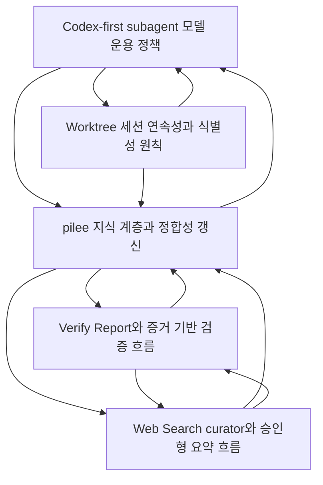

# pilee Knowledge

pilee knowledge는 private journal에서 뽑아낸 **public/sanitized 설계 지식**입니다. 개인적인 동기, 시행착오, 회사 맥락은 로컬 `docs/pilee-history.md`와 Notion why log에 남기고, 여기에는 현재도 유효한 구조·판단 기준·운영 규칙만 정리합니다.

## Journal vs Knowledge

| Layer | Visibility | Purpose |
|---|---|---|
| `docs/pilee-history.md` / Notion why log | private/local | 개인적 이유, 시행착오, 감정, 회사 맥락까지 포함한 원본 서사 |
| `docs/knowledge/*.md` | public/sanitized | 현재 pilee 기능을 이해하고 유지하는 데 필요한 범용 설계 지식 |
| generated README graph | public/sanitized | 지식 문서의 검색·탐색·링크 관계를 한눈에 확인 |

## Metadata schema

각 topic 문서는 아래 frontmatter를 가집니다.

```yaml
---
title: 문서 제목
tags: [search, keywords]
category: verification | web-access | agent | workflow | knowledge
status: active | experimental | deprecated | draft
applies_to:
  - skills/verify-report
  - extensions/archive-to-html
source:
  - pilee-history:2026-05-05#48
reviewed_at: 2026-05-05
related:
  - other-doc-id
supersedes:
  - previous decision or concept label
---
```

`applies_to`는 product knowledge의 code scope처럼 강한 유지보수 경계가 아니라, 이 지식이 설명하는 기능/스킬/확장 영역을 나타냅니다. 실제 코드 path일 수도 있고, `pilee-history`, `automation`, `subagent policy` 같은 concern label일 수도 있습니다.

## CLI

```bash
node scripts/knowledge.mjs --help
node scripts/knowledge.mjs verify-report
node scripts/knowledge.mjs --validate
node scripts/knowledge.mjs --graph
node scripts/knowledge.mjs --review-candidates
node scripts/knowledge.mjs --confirm verify-report-workflow
```

운영 원칙:

1. 새 지식을 쓰기 전 기존 문서를 검색합니다.
2. private journal 내용을 그대로 복붙하지 않고, 공개 가능한 설계 판단으로 재작성합니다.
3. 새 문서나 링크 변경 뒤 `--graph`로 README의 Topic Index/Knowledge Map을 재생성합니다.
4. 내용 검토가 끝난 문서는 `--confirm <doc-id>`로 `reviewed_at`을 갱신합니다.
5. 주기적 정합성 점검은 `--review-candidates` 출력과 GitHub workflow를 함께 사용합니다.

<!-- PILEE_KNOWLEDGE_GRAPH_START -->
> Generated by `node scripts/knowledge.mjs --graph`. Do not edit this block manually.

## Topic Index

### agent

| Topic | Status | Reviewed | Tags |
|---|---|---:|---|
| [Codex-first subagent 모델 운용 정책](./subagent-model-policy.md) | active | 2026-05-05 | subagent, codex, model-policy, worker, finder, searcher |

### knowledge

| Topic | Status | Reviewed | Tags |
|---|---|---:|---|
| [pilee 지식 계층과 정합성 갱신](./pilee-knowledge-system.md) | active | 2026-05-05 | pilee, knowledge, history, journal, sanitized, reviewed-at |

### verification

| Topic | Status | Reviewed | Tags |
|---|---|---:|---|
| [Verify Report와 증거 기반 검증 흐름](./verify-report-workflow.md) | active | 2026-05-05 | verify-report, verification, evidence, glimpse, live-preview, report |

### web-access

| Topic | Status | Reviewed | Tags |
|---|---|---:|---|
| [Web Search curator와 승인형 요약 흐름](./web-search-curator.md) | active | 2026-05-05 | web-search, tavily, curator, glimpse, summary-review, korean-output |

### workflow

| Topic | Status | Reviewed | Tags |
|---|---|---:|---|
| [Worktree 세션 연속성과 식별성 원칙](./worktree-session-continuity.md) | active | 2026-05-05 | worktree, session, revive, fork-panel, conductor, title |

## Knowledge Map



## Review Metadata Summary

- Documents: 5
- Links: 11
- Generated at: deterministic README build (timestamp intentionally omitted)
<!-- PILEE_KNOWLEDGE_GRAPH_END -->
